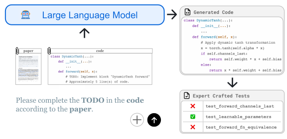
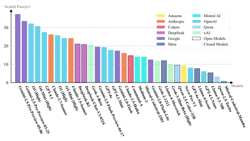

---
# Feel free to add content and custom Front Matter to this file.
# To modify the layout, see https://jekyllrb.com/docs/themes/#overriding-theme-defaults

layout: main
title: "ResearchCodeBench: Benchmarking LLMs on Implementing Novel Machine Learning Research Code"
---

{:width="100%" style="max-width: 8000px;"}
{:style="text-align: center;"}
<!-- *Figure 1: Overview of the  evaluation process* -->
**ResearchCodeBench** *collects recently released research* **papers** *and their corresponding* **code** *repository to construct a benchmark for evaluating code LLMs on research code generation.*
{:style="text-align: center;"}

# Introduction

ResearchCodeBench is a rigorous benchmark for evaluating LLMs on their ability to translate novel machine learning research papers into executable code. It is built from 212 real-world coding challenges sourced directly from top ML papers published in 2024–2025 and continues to grow through ongoing community contributions. We evaluate over 30 proprietary and open-source models and find that even the best-performing LLMs solve fewer than 40% of the challenges. In addition to performance scores, ResearchCodeBench presents novel empirical findings not captured by prior benchmarks.

{:width="100%" style="max-width: 8000px;"}
{:style="text-align: center;"}
*Pass@1\* results of 32 LLMs on ResearchCodeBench with greedy decoding. Models from different companies are noted with different shades. Open models are wrapped with dotted lines. \* Success rate is weighted by line of code of each answer*

# Contamination

  

    
  

  

    
  

*Left: Model knowledge cutoff dates (horizontal lines) vs. repository commit dates (stars). Red = first commit; green = last commit. Most first commits occur after model cutoffs, demonstrating minimal pretraining contamination. Right: Scaled Pass@1 on the full 20-paper benchmark vs. contamination-safe 13-paper subset. Points below the diagonal show performance declines on truly out-of-distribution tasks, confirming that model successes reflect generalization rather than memorized code.*

 
<!-- [TODO] Write a paragraph that concisely demonstrates our discovery on contamination. -->
To quantify the risk of pretraining contamination, we compared each model’s documented knowledge cutoff date against the first and last commit dates of the 20 code repositories underlying our benchmark tasks. As shown in the left panel, horizontal lines mark the most recent cutoff for each model family, while red stars indicate the date of the first commit and green stars the last commit of each repo. Thirteen of the twenty repositories began after the latest known model cutoff (January 2025), and none predate December 2023—strong evidence that the majority of tasks were unseen during pretraining. In the right panel, we plot each model’s Scaled Pass@1 on the full benchmark versus the contamination-safe subset (the 13 papers whose repos postdate all cutoffs). All models suffer a consistent drop below the diagonal, confirming that high scores on the full set cannot be explained by memorization alone but instead reflect genuine generalization to novel code.

 
# Paper Ablation

  

    
  

  

    
  

To isolate how much the original research paper aids code synthesis, we ran an ablation comparing Scaled Pass@1 with and without the paper in context. In the left panel, we plot absolute gains for each model: top performers like Gemini-2.5-Pro and O3 (High) see up to a 30 percentage-point boost when given the full paper, whereas smaller models show negligible or even negative changes—suggesting they either can’t leverage or are distracted by the long document. The right panel is a per-task scatter: each point’s x-coordinate is the success rate with paper, y-coordinate is without. Points above the diagonal denote tasks that only succeed when the paper is provided, highlighting cases where semantic understanding of the novel algorithm is essential.

