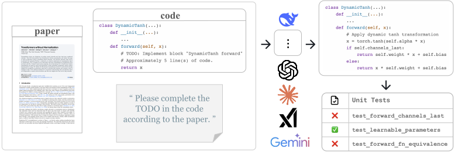
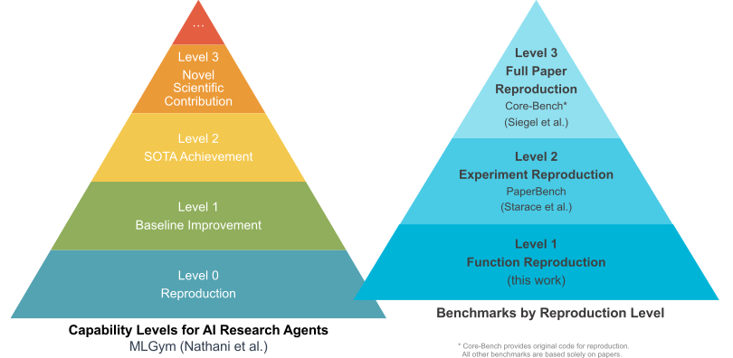
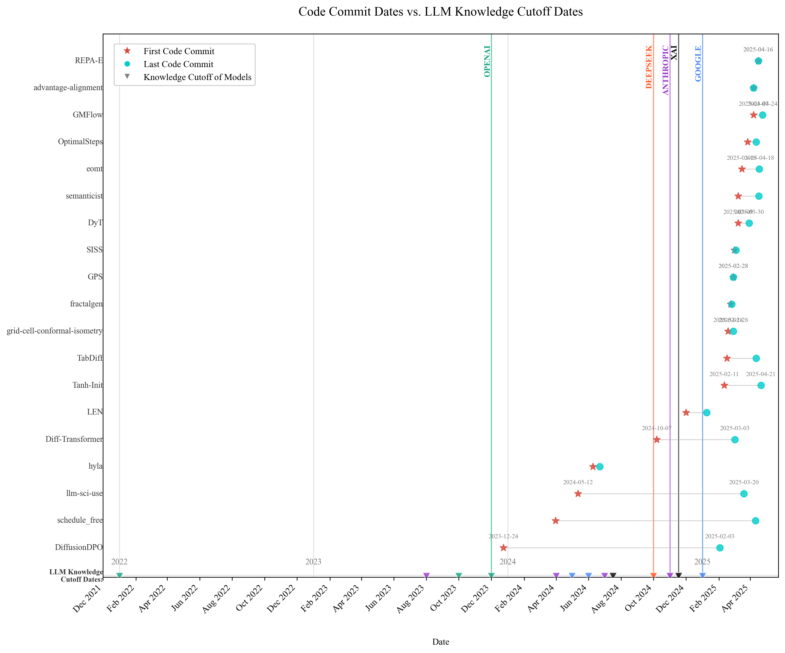
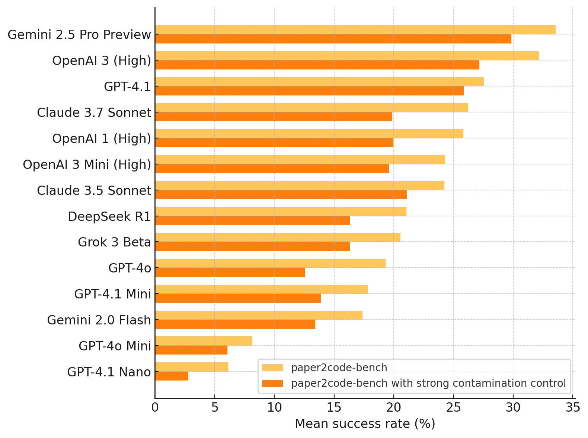
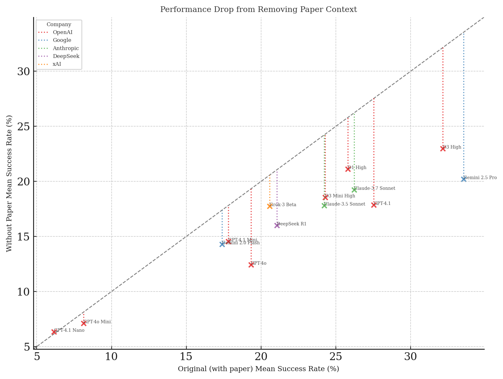

---
# Feel free to add content and custom Front Matter to this file.
# To modify the layout, see https://jekyllrb.com/docs/themes/#overriding-theme-defaults

layout: main
title: "Paper2Code-bench: Evaluating Large Language Models' Ability to Implement Novel Machine Learning Research"
---

{:width="100%" style="max-width: 8000px;"}
{:style="text-align: center;"}
*Figure 1: Overview of the Paper2Code benchmark and evaluation process*
{:style="text-align: center;"}

# Introduction

Large language models (LLMs) have demonstrated significant promise in machine learning research; however, their ability to implement genuinely novel ideas from recent academic papers remains uncertain. To address this gap, we introduce Paper2Code, a coding benchmark designed to evaluate LLMs on their capability to translate concepts from top-tier conference papers into executable code.

To this end, we introduce Paper2Code-bench, an evaluation benchmark consisting of 1,000 coding challenges with varying levels of difficulty. These challenges have been curated from 20 recent machine learning papers accepted at top ML conferences or recent arXiv submissions from the past year, with 80% of the papers published within the last six months. For each challenge, the LLM is provided with the original research paper and a scaffold of its corresponding codebase. The model is then tasked with implementing the core contributions described in the paper. Each solution is rigorously evaluated using comprehensive tests against the original code written by the authors.

## Comparison with PaperBench

While both Paper2Code-bench and PaperBench aim to evaluate language models' capabilities in understanding research papers, they differ significantly in their objectives and evaluation methodologies. Paper2Code-bench focuses specifically on implementing novel machine learning algorithms and architectures from research papers, requiring models to demonstrate both deep understanding of technical concepts and practical coding abilities.

Key differences include:
- Focus on implementation rather than just comprehension
- Rigorous evaluation through unit tests and code functionality
- Emphasis on recent (< 6 months) machine learning research
- Structured code scaffolding to standardize evaluation

## Papers Included in the Benchmark

Our benchmark includes 20 carefully selected papers from top machine learning conferences and recent arXiv submissions. Each paper introduces novel algorithms or architectures that represent significant advances in the field.

## Toward AI Research Agents

Our benchmark contributes to the broader goal of developing AI Research Agents capable of advancing scientific knowledge. We view the ability to implement novel research from papers as a critical stepping stone toward more sophisticated research capabilities.

The progression moves from basic reproduction to groundbreaking scientific contributions. Paper2Code-bench focuses on function reproduction, which requires models to understand and implement specific methods and algorithms described in research papers.

As models improve on this benchmark, we expect to see progress toward enabling AI systems that can assist researchers not just in implementing ideas but in developing and refining novel approaches to challenging problems in AI and beyond.

# Help Us Grow Paper2Code-bench!

We're looking for recent ML papers with available code to add to our benchmark. Paper2Code-bench is continuously evolving, and we welcome contributions from the research community to expand our collection of papers and implementation challenges.

Help us identify the core contributions within the code that test LLMs' ability to implement novel ideas. Your expertise will help shape the future of AI evaluation benchmarks.

### What We Need:
- **Paper Link** (arXiv, conference page, etc.)
- **Official GitHub Repository Link**
- **Your thoughts on the key code sections/lines to focus on**

### How to Submit:
You can submit your contribution through our [online form](https://forms.gle/xZarsnAa6a2u43Tr6). Or scan the QR code blow:
{:width="200px" style="display: block; margin: 0 auto;"}

### Contributors Get Credited!
All contributors will be acknowledged in our publications and on the official Paper2Code-bench website.

#### Why Your Contribution Matters
By contributing to Paper2Code-bench, you're helping advance the development of AI systems that can understand and implement novel research ideas. This benchmark serves as a critical evaluation tool for measuring progress toward more capable AI research assistants.

Join us in building the future of AI research tools! 

## List of papers

1. **Advantage Alignment Algorithms**  
   [Paper](https://arxiv.org/abs/2406.14662v3) | [Code](https://github.com/jduquevan/advantage-alignment)

2. **Differential Transformer**  
   [Paper](https://arxiv.org/abs/2410.05258v2) | [Code](https://aka.ms/Diff-Transformer)

3. **Diffusion Model Alignment Using Direct Preference Optimization**  
   [Paper](https://arxiv.org/abs/2311.12908v1) | [Code](https://github.com/SalesforceAIResearch/DiffusionDPO)

4. **Transformers without Normalization**  
   [Paper](https://www.arxiv.org/abs/2503.10622v1) | [Code](https://github.com/jiachenzhu/DyT)

5. **Your ViT is Secretly an Image Segmentation Model**  
   [Paper](https://arxiv.org/abs/2503.19108v1) | [Code](https://github.com/tue-mps/eomt/)

6. **Fractal Generative Models**  
   [Paper](https://arxiv.org/abs/2502.17437v2) | [Code](https://github.com/LTH14/fractalgen)

7. **Gaussian Mixture Flow Matching Models**  
   [Paper](https://arxiv.org/abs/2504.05304v1) | [Code](https://github.com/Lakonik/GMFlow)

8. **GPS: A Probabilistic Distributional Similarity with Gumbel Priors for Set-to-Set Matching**  
   [Paper](https://openreview.net/forum?id=U0SijGsCHJ) | [Code](https://github.com/Zhang-VISLab/ICLR2025-GPS)

9. **On Conformal Isometry of Grid Cells: Learning Distance-Preserving Position Embedding**  
   [Paper](https://arxiv.org/abs/2405.16865v4) | [Code](https://github.com/DehongXu/grid-cell-conformal-isometry)

10. **Attention as a Hypernetwork**  
    [Paper](https://arxiv.org/abs/2406.05816v4) | [Code](https://github.com/smonsays/hypernetwork-attention)

11. **Second-Order Min-Max Optimization with Lazy Hessians**  
    [Paper](https://arxiv.org/abs/2410.09568v1) | [Code](https://github.com/TrueNobility303/LEN)

12. **Mapping the increasing use of LLMs in scientific papers**  
    [Paper](https://arxiv.org/abs/2404.01268v1) | [Code](https://github.com/Weixin-Liang/Mapping-the-Increasing-Use-of-LLMs-in-Scientific-Papers)

13. **Min-p Sampling for Creative and Coherent LLM Outputs**  
    [Paper](https://arxiv.org/abs/2407.01082v4) | [Code](https://github.com/menhguin/minp_paper)

14. **Optimal Stepsize for Diffusion Sampling**  
    [Paper](https://arxiv.org/abs/2503.21774v1) | [Code](https://github.com/bebebe666/OptimalSteps)

15. **REPA-E: Unlocking VAE for End-to-End Tuning with Latent Diffusion Transformers**  
    [Paper](https://arxiv.org/abs/2504.10483v1) | [Code](https://github.com/jduquevan/REPA-E)

16. **The Road Less Scheduled**  
    [Paper](https://arxiv.org/abs/2405.15682v4) | [Code](https://github.com/facebookresearch/schedule_free)

17. **Principal Components Enable A New Language of Images**  
    [Paper](https://arxiv.org/abs/2503.08685v1) | [Code](https://github.com/visual-gen/semanticist)

18. **Data Unlearning in Diffusion Models**  
    [Paper](https://arxiv.org/abs/2503.01034) | [Code](https://github.com/claserken/SISS)

19. **TabDiff: a Mixed-type Diffusion Model for Tabular Data Generation**  
    [Paper](https://arxiv.org/abs/2410.20626v3) | [Code](https://github.com/MinkaiXu/TabDiff)

20. **Robust Weight Initialization for Tanh Neural Networks with Fixed Point Analysis**  
    [Paper](https://arxiv.org/abs/2410.02242v2) | [Code](https://github.com/1HyunwooLee/Tanh-Init)
